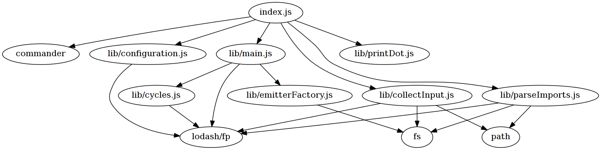

# js-module-walker

[](https://travis-ci.org/migerh/js-module-walker)
[](https://codeclimate.com/github/migerh/js-module-walker)
[](https://codeclimate.com/github/migerh/js-module-walker/coverage)

A dependency analyzer for ECMAScript projects that use es6 modules.

## Installation

```bash
# npm install -g @migerh/js-module-walker
```

## Usage

Invoke with `--help` or `-h` to get up to date information of the accepted input parameters:

```bash
  Usage: js-module-walker [options] <files>

  Options:

    -h, --help           output usage information
    -o, --output [file]  save output in file
    --find-cycles        detect and highlight cyclic dependencies
    --ignore-packages    ignore dependencies into packages from e.g. node modules
```

Examples:

```bash
$ js-module-walker ./path/to/your/js-project
$ js-module-walker --ignore-packages --output /tmp/dependencies.dot ./path/to/js-files
```

### js-module-walker

An analysis of this very project as of d8636e14 produces the graph below

```bash
$ js-module-walker index.js ./lib | dot -o./examples/js-module-walker-d8636e14.png -T png
```




### [4minitz](https://github.com/4minitz/4minitz)

An open source webapp for meeting minutes; version https://github.com/4minitz/4minitz/commit/215091a7d.
The analysis is restricted to the client side modules.

```bash
$ js-module-walker --find-cycles --ignore-packages ./client/**/*.js ./lib/**/*.js ./imports/**/*.js | dot -Tpng -o./examples/4minitz-client-w-cycles-wo-packages-215091a7d.png
```

Graph: [4minitz dependency graph](examples/4minitz-client-w-cycles-wo-packages-215091a7d.png)

## Contributors

@yogan

## License

This project is licensed under the terms of the MIT license. See the [LICENSE](LICENSE) file for more information.
